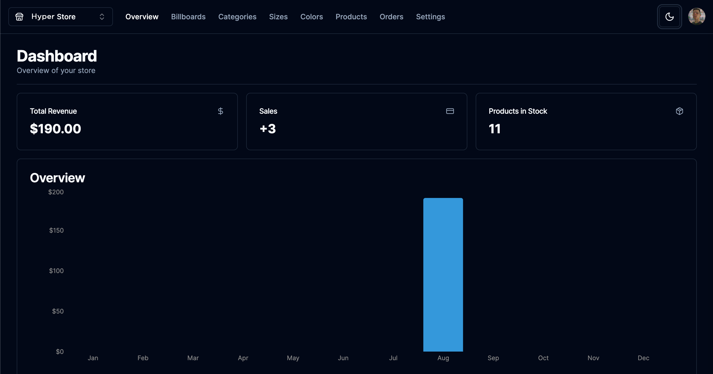

[TYPESCRIPT__BADGE]: https://img.shields.io/badge/typescript-D4FAFF?style=for-the-badge&logo=typescript
[NEXT]: https://img.shields.io/badge/Next.js-black?style=for-the-badge&logo=nextdotjs
[ZOD]: https://img.shields.io/badge/Zod-black?style=for-the-badge&logo=zod
[AXIOS]: https://img.shields.io/badge/Axios-black?style=for-the-badge&logo=axios&logoColor=black&color=fff
[TAIL]: https://img.shields.io/badge/Tailwind-%2300027a?style=for-the-badge&logo=tailwindcss
[PRISMA]: https://img.shields.io/badge/Prisma-55DBCB?style=for-the-badge&logo=prisma

<h1 align="center" style="font-weight: bold;">
Store

Admin | CMS | API
</h1>

<div align="center">

  ![next.js][NEXT]
  ![typescript][TYPESCRIPT__BADGE]
  ![prisma][PRISMA]
  ![zod][ZOD]
  ![axios][AXIOS]
  ![tail][TAIL]

</div>

<p align="center">
 <a href="#started">Getting Started</a> • 
  <a href="#routes">API Endpoints</a> •
</p>

<p align="center">
    
</p>


<h2 id="started">📌 About</h2>

This project offers a comprehensive solution for online stores businesses, providing a feature-rich admin portal for content, store management and analytics.


<h2 id="started">🚀 Getting started</h2>

<h3>Prerequisites</h3>

- [NodeJS](https://nodejs.org/en)

<h3>Cloning</h3>

How to clone your project

```bash
git clone https://github.com/vitorstaub/store-admin.git

cd store-admin
```

<h3>Install Packages</h3>

```bash
npm install
```

<h3> Environment Variables</h2>

Use the `.env` as reference to create your configuration file `.env` with your Clerk, Database and Cloudinary Credentials

.env file
```yaml
NEXT_PUBLIC_CLERK_PUBLISHABLE_KEY={CLERK_PUBLIC_KEY}
CLERK_SECRET_KEY={CLERK_SECRET_KEY}

DATABASE_URL={DATABASE_KEY}

NEXT_PUBLIC_CLOUDINARY_CLOUD_NAME={CLOUDINARY_KEY}
```

<h3>Prisma Generate and Push</h3>

```
npx prisma generate
npx prisma db push
```

<h3>Starting</h3>

How to start the project

```bash
npm run dev
```


<h2 id="routes">📍 API Endpoints</h2>

Here you can list the main routes of your API.
​
| products route               | description                                          
|----------------------|-----------------------------------------------------
|  <kbd>public</kbd>  <kbd>GET /api/{storeId}/products</kbd>     | retrieves products info
|  <kbd>admin</kbd>  <kbd>POST /api/{storeId}/products</kbd>     | add products
|  <kbd>admin</kbd>  <kbd>PATCH /api/{storeId}/products/{productId}</kbd>     | edit product 
|  <kbd>admin</kbd>  <kbd>DELETE /api/{storeId}/products/{productId}</kbd>     | remove product 

| billboards route               | description                                          
|----------------------|-----------------------------------------------------
|  <kbd>public</kbd>  <kbd>GET /api/{storeId}/billboards</kbd>     | retrieves billboards info 
|  <kbd>admin</kbd>  <kbd>POST /api/{storeId}/billboards</kbd>     | add billboards 
|  <kbd>admin</kbd>  <kbd>PATCH /api/{storeId}/billboards/{billboardId}</kbd>     | edit billboard 
|  <kbd>admin</kbd>  <kbd>DELETE /api/{storeId}/billboards/{billboardId}</kbd>     | remove billboard 

| categories route               | description                                          
|----------------------|-----------------------------------------------------
|  <kbd>public</kbd>  <kbd>GET /api/{storeId}/categories</kbd>     | retrieves categories info 
|  <kbd>admin</kbd>  <kbd>POST /api/{storeId}/categories</kbd>     | add categories  
|  <kbd>admin</kbd>  <kbd>PATCH /api/{storeId}/categories/{categoryId}</kbd>     | edit category 
|  <kbd>admin</kbd>  <kbd>DELETE /api/{storeId}/categories/{categoryId}</kbd>     | remove category 

| sizes route               | description                                          
|----------------------|-----------------------------------------------------
|  <kbd>public</kbd>  <kbd>GET /api/{storeId}/sizes</kbd>     | retrieves sizes info 
|  <kbd>admin</kbd>  <kbd>POST /api/{storeId}/sizes</kbd>     | add sizes 
|  <kbd>admin</kbd>  <kbd>PATCH /api/{storeId}/sizes/{sizeId}</kbd>     | edit size 
|  <kbd>admin</kbd>  <kbd>DELETE /api/{storeId}/sizes/{sizeId}</kbd>     | remove size 

| colors route               | description                                          
|----------------------|-----------------------------------------------------
| <kbd>public</kbd> <kbd>GET /api/{storeId}/colors</kbd>     | retrieves colors info 
| <kbd>admin</kbd> <kbd>POST /api/{storeId}/colors</kbd>     | add colors 
| <kbd>admin</kbd> <kbd>PATCH /api/{storeId}/colors/{colorId}</kbd>     | edit color 
| <kbd>admin</kbd> <kbd>DELETE /api/{storeId}/colors/{colorId}</kbd>     | remove color 
